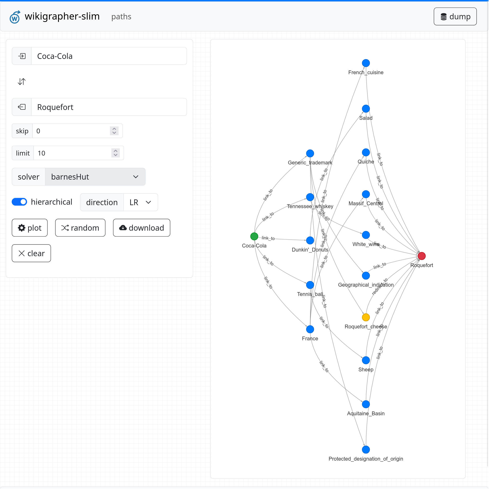

#  wikigrapher-slim

explore wikipedia as a graph [https://wikigrapher.com/](https://wikigrapher.com)



standalone public release web app for [7mza/wikigrapher-generator](https://github.com/7mza/wikigrapher-generator)

## reqs

[jdk 24](https://sdkman.io)

```shell
sdk env install
```

[node lts](https://github.com/nvm-sh/nvm)

```shell
nvm install
```

[docker](https://docs.docker.com/desktop)

## setup neo4j

refer to [7mza/wikigrapher-generator](https://github.com/7mza/wikigrapher-generator) to generate graph & setup neo4j

## build

```shell
npm i
```

webpack production mode

```shell

npm run build && ./gradlew clean ktlintFormat ktlintCheck build
```

webpack development mode

```shell
npm run build:dev && ./gradlew clean ktlintFormat ktlintCheck build -Pmode=development
```

if gradle-node-plugin is giving errors

```shell
./gradlew --stop
```

## run

spring is configured with compose support, run with ide or

```shell
./gradlew buildLocalDockerImage
```

```shell
docker compose up --build
```

[http://localhost:8080/](http://localhost:8080/)

## license

this project is licensed under the [GNU Affero General Public License v3.0](./LICENSE.txt)

wikipedia® is a registered trademark of the wikimedia foundation

this project is independently developed and not affiliated with or endorsed by the wikimedia foundation
